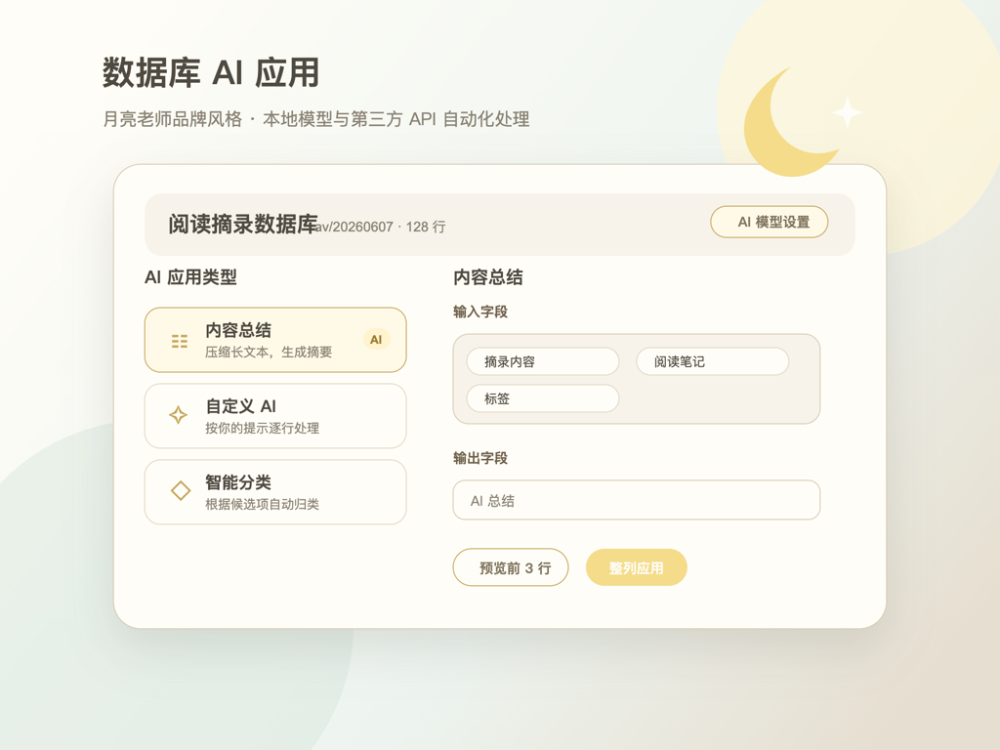

# Database AI Applications

Bring configurable AI automation to SiYuan databases.



[中文说明](README_zh_CN.md)

## Features

- Adds an `AI Applications` entry to each database.
- Summarize long text into concise results.
- Run custom AI instructions using any selected database fields.
- Classify rows using your own category list.
- Extract structured information such as names, phone numbers, and tags.
- Fill numeric columns with spreadsheet-like formulas.
- Preview the first 3 rows before applying an operation to a full column.
- Persist AI model settings in SiYuan plugin data and restore them after restart.

## Model Support

- Local models: Ollama and LM Studio.
- APIs: OpenAI, DeepSeek, Kimi, Zhipu GLM, Alibaba DashScope, Google Gemini, and Anthropic Claude.
- Aggregators: SiliconFlow and OpenRouter.
- Custom third-party APIs with configurable protocol, base URL, API key, and model name.

Remote requests are forwarded through SiYuan's kernel proxy to avoid browser CORS restrictions. When using a third-party API, selected database content is sent to that provider. API keys are stored only in the current SiYuan client.

## Formula Examples

```text
={Price}*{Quantity}
ROUND(AVG({Score 1},{Score 2}), 1)
SUM({Income},-{Expense})
```

Supported functions: `SUM`, `AVG`, `MIN`, `MAX`, `ROUND`, `ABS`, `COUNT`, `POW`, and `SQRT`.

## Usage

1. Open a document containing a database.
2. Click `AI Applications` in the database header.
3. Configure a local model or third-party API.
4. Choose an operation, input fields, and an output field.
5. Preview the first rows, then apply the operation to the full column.

## Changelog

### v0.3.4

- Refined the AI tool panel with the Moon Teacher brand style: warm off-white, mist green, tea gray, and soft gold.
- Updated the plugin logo and marketplace preview image to match the brand identity.

### v0.3.3

- Updated the WeChat donation QR code used by the README and plugin assets.

### v0.3.2

- Disabled the plugin in publish mode, following the marketplace review requirement for plugins that store AI configuration.
- Added uninstall cleanup for persisted model settings and legacy browser local storage settings.

### v0.3.1

- Fixed AI model settings being lost after restarting SiYuan.
- Model settings are now persisted in SiYuan plugin data and restored automatically.
- Added migration from legacy browser local storage settings on first panel open.

### v0.3.0

- Changed custom AI input fields to a checkbox list.
- Custom AI can now use any one or more fields from the current database.
- Added select all and clear actions for input fields.

## Support

If this plugin helps you, you can support the author via WeChat Pay.


## License

[MIT](LICENSE)
